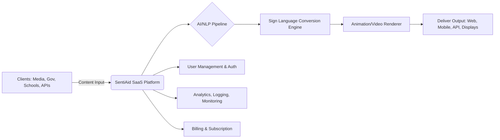
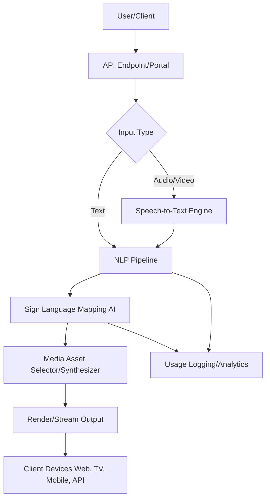

# 🧠 SentiAid – Inclusive Communication SaaS Platform

Empowering Media, Government, Education, and Public Spaces with AI-powered Sign Language Accessibility

## 1. Executive Summary

SentiAid is a deep-tech SaaS platform enabling seamless Indian Sign Language (ISL) translation using AI and NLP. We serve media houses, government agencies, educational institutions, and public infrastructure - helping them meet accessibility mandates and reach underserved deaf and mute communities.

Our MVP enables both live and recorded content translation into ISL, making media and information inclusive. Backed by the VIT TBI, NSRCEL IIM Bangalore, Microsoft, AWS, Wadhwani Foundation & Startlabs Innovations SentiAid brings together state-of-the-art AI, scalable cloud infrastructure, and domain-specific training to build India's most reliable sign language accessibility solution.

## 2. User Persona

**Name:** Aarti Sharma  
**Role:** Accessibility Officer at a National News Channel

**Responsibilities:**
- Ensure all live and recorded news is inclusive
- Drive accessibility innovation
- Meet social impact, CSR, and regulatory goals

**Pain Points:**
- Manual sign translation is slow, expensive, and unscalable
- Struggles with integrating accessibility into legacy broadcast workflows
- No visibility into accessibility analytics or user engagement

**Needs:**
- Plug-and-play solution for live sign language overlay
- API integration with broadcasting software
- Compliance with RPWD Act and CSR goals
- Real-time and batch support with analytics

## 3. Market Opportunity

**India:** 63 million+ with significant hearing impairment (WHO, 2023)  
**Global:** Over 466 million  
**<5% of content accessible to deaf/mute audiences**

**Accessibility mandates growing under:**
- RPWD Act 2016
- NEP 2020
- CSR impact expectations

**Market segments ripe for disruption:**
- News & Entertainment (TV & OTT)
- Government Public Communication
- Smart Classrooms & Online Learning
- Smart Cities & Public Displays
- Corporate training & compliance

**Global TAM:** Multi-billion dollar opportunity

## 4. Core Use Cases

- 🗞️ News Channels – Live and recorded sign language overlays
- 🧑‍🏫 Schools/Colleges – Inclusive e-learning & hybrid classrooms
- 🏛️ Government Announcements – Digital signage, emergency updates
- 🏙️ Public Infrastructure – Airports, metros, railway platforms
- 🏢 Corporate Campaigns – Inclusive brand messaging and training
- 🏟️ Live Events – Sports, rallies, town halls

## 5. High-Level Product Architecture

## 6. Internal Working: Step-by-Step Flow

### Input Ingestion

- Users send live or batch content (audio, video, or text) via web portal or API

### Speech/Text Processing

- Audio → Text using ASR (Google, Azure, DeepSpeech)
- Text cleaned, lemmatized, and tagged (spaCy, NLTK)

### Sign Language Mapping

- AI models map sentence structure → ISL sequence
- Tense, gender, grammar adjusted per ISL rules

### Rendering

- Matching sign video assets selected or synthesized
- Videos compiled into a fluent stream

### Output Delivery

- Delivered via web, mobile, TV overlays, or API
- Supports both real-time and batch pipelines

### Analytics & Monitoring

- Dashboard for usage, errors, engagement
- Compliance reporting and alerts

## 7. Backend Architecture (AI & Media Flow)

## 8. Tech Stack Overview

| Layer | Technology/Service |
|-------|--------------------|
| Frontend | React.js, Next.js, TailwindCSS |
| Backend/API | Django, FastAPI, Python |
| NLP/AI Models | NLTK, spaCy, Transformers, ASR (Google, Azure), TTS |
| Media Processing | FFmpeg, OpenCV |
| Database | PostgreSQL, Redis |
| Hosting/Cloud | AWS/GCP/Azure, Docker, Kubernetes |
| CI/CD | GitHub Actions, Docker Hub |
| Auth | JWT, OAuth, SSO, Django Auth |
| API Protocols | REST, GraphQL, WebSocket |
| Monitoring | Prometheus, Sentry, ELK Stack |
| Analytics | Mixpanel, Google Analytics |
| Billing | Stripe, Razorpay |

## 9. AI Model Performance & Validation

| Metric | Detail |
|--------|--------|
| Accuracy | BLEU, ROUGE, and domain-specific metrics for translation quality |
| Human Review | Human-in-the-loop validation with sign language experts |
| Latency | Sub-second response for live, batch for bulk uploads |
| Fallbacks | Letter-by-letter spelling if word not in dataset |
| Continuous Learning | Feedback loop from users and educators |

## 10. SaaS Capabilities

- ✅ Multi-tenant architecture
- 🔐 Secure Auth & RBAC
- 💳 Self-service billing and subscription
- 📊 Dashboards for usage & compliance
- ⚙️ Developer-friendly APIs
- 🏷️ White-label capability
- 📚 Easy onboarding (docs, SDKs, sandbox)
- 🚨 Alerts, audit logs, error tracking

## 11. Security & Compliance

- AES-256 data encryption (at rest and transit)
- GDPR + RPWD Act 2016 compliance
- Regular vulnerability scanning & audits
- API rate limiting, role-based permissions
- SLAs and uptime guarantees

## 12. Why Now?

- 🔺 Accessibility mandates from NEP 2020 & RPWD Act accelerating adoption
- 🧠 Maturity in AI/Cloud tech allows real-time translation affordably
- 🧑‍🦽 Underserved communities demanding inclusion
- 💼 CSR goals and ESG compliance fueling adoption in large enterprises
- 🌍 Global push for inclusive media & education

## 13. Competitive Moats

- 🇮🇳 India-focused ISL models (not ASL)
- 🕒 Real-time & batch mode
- 🎯 Pre-integrated with media workflows (OBS, AWS IVS, etc.)
- 🧾 Reporting, dashboards, and compliance-ready
- 📚 Large curated video dataset for ISL gestures
- 🧩 Modular API integrations

## 14. Go-to-Market Strategy

- B2B Enterprise Sales: Direct sales to news agencies, gov bodies, edu boards
- API Model: Integration into LMS, OTT, transport screens
- Partnerships: Collaborate with accessibility NGOs, ISL associations
- Government Projects: State-level MoUs for smart city deployments
- Community Uplift: Inclusion drives in schools and public media

## 15. Roadmap & Next Steps

- 🚀 Expand pilots with 3–5 broadcasters and state gov departments
- 💾 Scale cloud backend with GPU + containerized sign rendering
- 🧠 Expand ISL gesture dataset (target 1M+ video clips)
- 🔄 Launch user feedback loop for translation accuracy
- 📱 Launch mobile SDK & LMS plugins (Moodle, Blackboard)

## Contact

**Harsh Singh**  
Founder – SentiAid  
Selected by NSRCEL, IIM Bangalore (Campus Founder Program)  
📧 [support@sentiaid.co.in]  
🌐 [sentaid.co.in]

